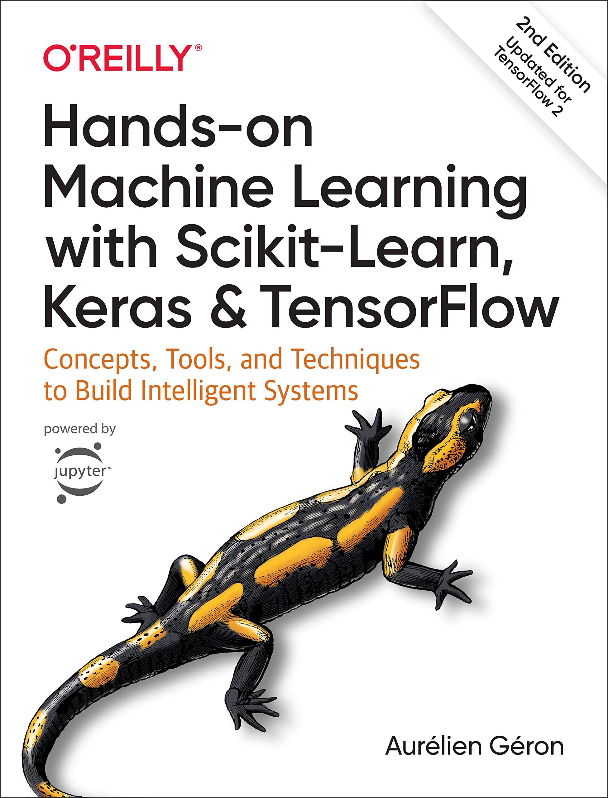

# Machine Learning Study

This study will be dedicated to developing skill in different machine learning applications. This will build and develop all the necessary skills to form a full stack for a career as a *Data Scientist*.

This study will complete the chapters and exercises from the following book:

Some code examples will be taken graciously from [the author's repository](https://github.com/ageron/handson-ml2).

This repository will have notes that may be considered **supplemental** material for the already existing chapters in the book. If you wish to have full knowledge and intuition on implementing machine learning algorithms, please support the author and <a href="https://www.amazon.com/Hands-Machine-Learning-Scikit-Learn-TensorFlow/dp/1492032646/"> purchase the book</a>.

---

## Tools
    
- [Python](https://www.python.org/downloads/)
- [NumPy](https://numpy.org/install/)
- [pandas](https://pandas.pydata.org/pandas-docs/stable/getting_started/install.html)
- [Matplotlib](https://matplotlib.org/stable/users/installing.html)
- [JupyterLab](https://jupyterlab.readthedocs.io/en/stable/getting_started/installation.html)
- [Scikit-Learn](https://scikit-learn.org/stable/install.html)
- [TensorFlow](https://www.tensorflow.org/install)
- [Keras](https://keras.io/getting_started/)

## Table of Contents

1. [The Machine Learning Landscape](1-ml-landscape/notes.md)